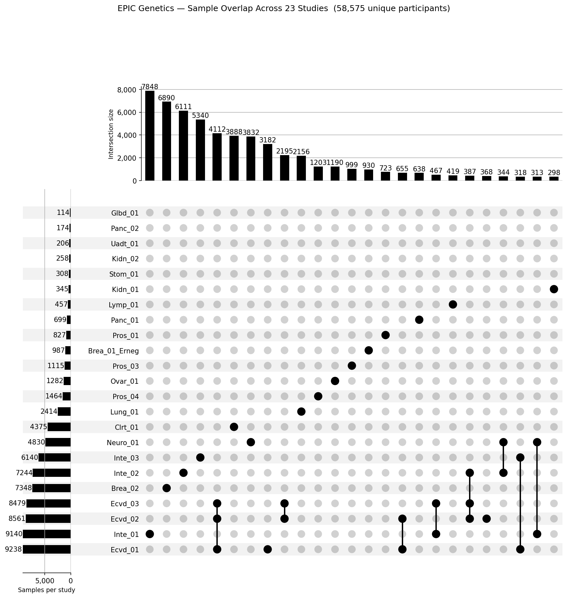

# Studies

Per-study master reports integrate QC summaries from stage 2 (imputation) and stage 3 (sample and variant QC). Reports are generated by `bash src/008_documentation.sh` and committed to this repository.

## Master Reports

| Study | N | Variants | Mean ER2 | Report |
| --- | ---: | ---: | ---: | --- |
| Brea_01_Erneg | 987 | 11,593,992 | 0.9435 | [report](reports/Brea_01_Erneg.master-report.html) |
| Brea_02 | 7,348 | 11,634,844 | 0.9328 | [report](reports/Brea_02.master-report.html) |
| Clrt_01 | 4,375 | 11,575,819 | 0.9513 | [report](reports/Clrt_01.master-report.html) |
| Ecvd_01 | 9,238 | 11,617,557 | 0.9152 | [report](reports/Ecvd_01.master-report.html) |
| Ecvd_02 | 8,561 | 11,381,963 | 0.8923 | [report](reports/Ecvd_02.master-report.html) |
| Ecvd_03 | 8,479 | 9,644,865 | 0.9080 | [report](reports/Ecvd_03.master-report.html) |
| Glbd_01 | 114 | 11,617,976 | 0.9416 | [report](reports/Glbd_01.master-report.html) |
| Inte_01 | 9,140 | 11,576,056 | 0.9436 | [report](reports/Inte_01.master-report.html) |
| Inte_02 | 7,244 | 11,648,231 | 0.9129 | [report](reports/Inte_02.master-report.html) |
| Inte_03 | 6,140 | 11,228,590 | 0.9197 | [report](reports/Inte_03.master-report.html) |
| Kidn_01 | 345 | 11,614,105 | 0.9420 | [report](reports/Kidn_01.master-report.html) |
| Kidn_02 | 258 | 11,556,383 | 0.9778 | [report](reports/Kidn_02.master-report.html) |
| Lung_01 | 2,414 | 11,655,446 | 0.9326 | [report](reports/Lung_01.master-report.html) |
| Lymp_01 | 457 | 11,659,973 | 0.9417 | [report](reports/Lymp_01.master-report.html) |
| Neuro_01 | 4,830 | 11,852,050 | 0.9031 | [report](reports/Neuro_01.master-report.html) |
| Ovar_01 | 1,282 | 11,688,077 | 0.9319 | [report](reports/Ovar_01.master-report.html) |
| Panc_01 | 699 | 11,605,968 | 0.9427 | [report](reports/Panc_01.master-report.html) |
| Panc_02 | 174 | 11,585,552 | 0.9487 | [report](reports/Panc_02.master-report.html) |
| Pros_01 | 827 | 11,576,657 | 0.9461 | [report](reports/Pros_01.master-report.html) |
| Pros_03 | 1,115 | 11,658,676 | 0.9318 | [report](reports/Pros_03.master-report.html) |
| Pros_04 | 1,464 | 11,325,579 | 0.9339 | [report](reports/Pros_04.master-report.html) |
| Stom_01 | 308 | 11,632,113 | 0.9401 | [report](reports/Stom_01.master-report.html) |
| Uadt_01 | 206 | 11,652,795 | 0.9320 | [report](reports/Uadt_01.master-report.html) |

Reports are self-contained HTML files; open them directly in a browser after downloading.

## Sample Overlap

The UpSet plot below shows the intersection sizes across studies. Each bar represents the number of participants shared by the indicated combination of studies.

**Total unique participants across all 23 studies: 58,575** (76,005 total sample-study pairs; 11,416 participants appear in two or more studies).
